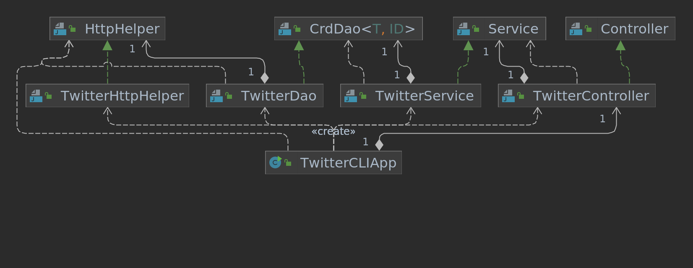

# Introduction

Twitter project is used for exploring Twitter API. The project will allow user to create, find by
ID, and delete by ID of a tweet. The project uses HTTP client to execute Http requests. Maven is
used to manage dependencies and build project. Spring framework is applied for managing Dependency
Injection(DI). JUnit 4 and Mockito is used for testing purpose. The app will be dockerized so that
user can use in any systems.

# Quick Start

Run app by using Docker:

- Post a tweet

```aidl
docker build -t twitter_app .
docker run --rm \
-e consumerKey=YOUR_CONSUMER_KEY \
-e consumerSecret=YOUR_CONSUMER_SECRET \
-e accessToken=YOUR_ACCESS_TOKEN \
-e tokenSecret=YOUR_TOKEN_SECRET \
twitter_app post tweet_text latitude:longitude
```

- Show a tweet

```
docker build -t twitter_app .
docker run --rm \
-e consumerKey=YOUR_CONSUMER_KEY \
-e consumerSecret=YOUR_CONSUMER_SECRET \
-e accessToken=YOUR_ACCESS_TOKEN \
-e tokenSecret=YOUR_TOKEN_SECRET \
twitter_app show tweet_id [field1,field2,...]
```

- Delete tweet(s)

```
docker build -t twitter_app .
docker run --rm \
-e consumerKey=YOUR_CONSUMER_KEY \
-e consumerSecret=YOUR_CONSUMER_SECRET \
-e accessToken=YOUR_ACCESS_TOKEN \
-e tokenSecret=YOUR_TOKEN_SECRET \
twitter_app delete [tweet_id1,tweet_id2,...]
```

# Design

## UML diagram

<p align="center" >
    
</p>

## Explain each component(app/main, controller, service, DAO)

### App/main

The app is built based on MVC structure. The main will be used to call controller and run the app

### Controller

The controller layer interacts and parsers user input (CLI args in this APP). It also calls the
service layer and returns results.

### Service

The service layer handles business logic and calls DAO layer in order to interact with the
underlying storage/service which is the Twitter REST API in this app.

### DAO

The data access layer handles models (implemented with POJOs). In this app, the DAO layer
save/show/delete tweet(s).

# Models

The Tweet object: `created_at` `id` `id_str` `text` `entities`
`coordinates` `retweet_count` `favorite_count` `favorited` `retweeted`.

The Entities object: `hashtags` `user_mentions`.

The Coordinates object: `coordinates` `type`.

## Deployment

The app will be deployed on Dockerhub and Github

# Improvement

- Building a friendly GUI interface
- Improving and adding more features like (like, retweet, etc..)