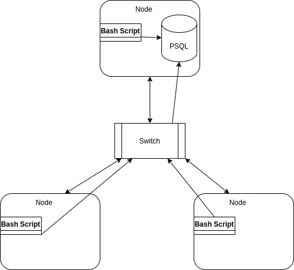

#Linux Cluster Monitoring Agent

##Introduction

Linux Cluster Monitoring Agent tool is used to monitor statistics of resource usage of nodes in the real time in a network which is connected through a switch. The app is implemented by using bash scripts and PSQL for storaging data.Besides, Docker will be used to create a image for lighweight, and multiple environment usage purpose usage

##Architechture and Design

    

As above introduction, Each node is connected throught a switch. there will be node that have PSQL instance. this node can send query from the script directly to the database while other node has to be sent throught the switch to approach the database.

###Databse Model
Database name: host_agent

####host_info Table:
`id`
`hostname`
`cpu_number`
`cpu_architecture`
`cpu_model`
`cpu_mhz`
`l2_cache`
`total_mem`
`timesstamp`

####host_usage Table:
`host_id`
`mem_free`
`cpu_idle`
`cpu_kernel`
`disk_io`
`disk_available`
`timestamp`

